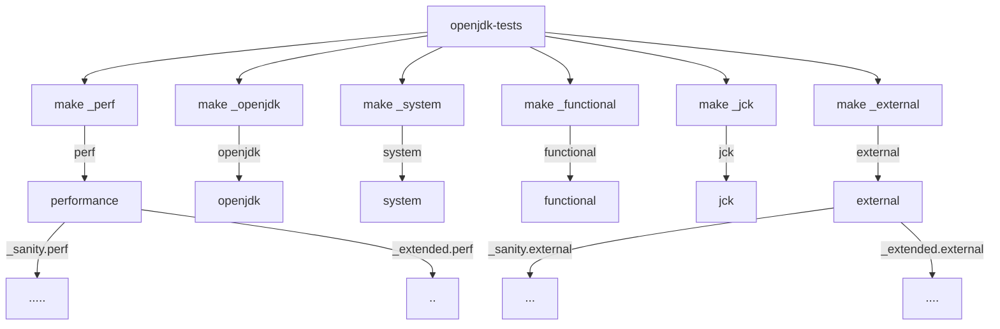
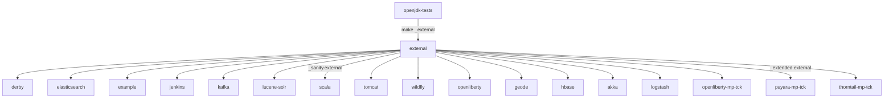

<!--
Licensed under the Apache License, Version 2.0 (the "License");
you may not use this file except in compliance with the License.
You may obtain a copy of the License at

[1]https://www.apache.org/licenses/LICENSE-2.0

Unless required by applicable law or agreed to in writing, software
distributed under the License is distributed on an "AS IS" BASIS,
WITHOUT WARRANTIES OR CONDITIONS OF ANY KIND, either express or implied.
See the License for the specific language governing permissions and
-->

<!-- PROJECT LOGO -->

<p align="center">
  <a href="https://adoptium.net/aqavit">
    
  </a>
</p>
<br />

[](https://github.com/adoptium/aqa-tests/blob/master/LICENSE)
[](https://github.com/adoptium/aqa-tests/graphs/contributors)
[](https://github.com/adoptium/aqa-tests/commits/master)
[](https://github.com/adoptium/aqa-tests/issues?q=is%3Aissue+is%3Aclosed)
[](https://github.com/adoptium/aqa-tests/pulls?q=is%3Apr+is%3Aclosed)
[](https://github.com/adoptium/aqa-tests/releases)
<br />
[](https://adoptium.net/slack/)
[](https://twitter.com/adoptium)

# Adoptium Testing

#### Guide to the Test Jobs at Adoptium

For nightly and release builds, there are test jobs running as part of the Adoptium continuous delivery pipelines.  There is a [blog post and brief presentation](https://blog.adoptopenjdk.net/2017/12/testing-java-help-count-ways) that explains what testing we run and how they fit into the overall delivery pipeline.  As the world of testing at Adoptium is evolving and improving quickly, some documentation may fall behind the march of progress.  Please let us know and help us keep it up-to-date, and ask questions at the [Adoptium testing Slack channel](https://adoptium.slack.com/archives/C5219G28G)!


#### Test 'Inventory'

The directory structure in this aqa-tests repository is meant to reflect the different types of test we run (and pull from lots of other locations).  The diagrams below show the test make target for each of the types, along with in-plan, upcoming additions (denoted by dotted line grey boxes). The provided links jump to test jobs in Jenkins (ci.adoptium.net).



--- 

##### [openjdk](https://ci.adoptium.net/view/Test_openjdk/) tests - OpenJDK regression tests 
Tests from OpenJDK

--- 

##### [system](https://ci.adoptium.net/view/Test_system/) tests - System and load tests 
Tests from the adoptium/aqa-systemtest repo

--- 

##### [external](https://ci.adoptium.net/view/Test_external/) tests - 3rd party application tests
Test suites from a variety of applications, along with microprofile TCKs, run in Docker containers



--- 

##### [perf](https://ci.adoptium.net/view/Test_perf/) tests - Performance benchmark suites 
Performance benchmark tests (both full suites and microbenches) from different open-source projects such as Acme-Air and adoptium/bumblebench

```mermaid
graph TD
 A[openjdk-tests] -->|make _perf| B[performance]
    B -->|_sanity.perf| C[bbench]
    B --> D[idle_micro]
    B --> E[odm]
    B -->|_extended.perf| F[liberty_dt]
    B --> G[acme_air]
   ```

--- 

##### [functional](https://ci.adoptium.net/view/Test_functional/) tests - Unit and functional tests
Functional tests not originating from the openjdk regression suite, that include locale/language tests and a subset of implementation agnostic tests from the openj9 project.

--- 

##### jck tests - Compliance tests
TCK tests (under the OpenJDK Community TCK License Agreement), in compliance with the license agreement.  While this test material is currently not run at the Adoptium project (see the [support statement](https://adoptopenjdk.net/support.html#jck) for details), those with their own OCTLA agreements may use the Adoptium test automation infrastructure to execute their TCK test material in their own private Jenkins servers.

--- 

#### Guide to Running the Tests Yourself
For more details on how to run the same tests that we run at Adoptium on your laptop or in your build farm, please consult our [User Guide](doc/userGuide.md) (work in progress).

#### What is our motivation?
We want:
- better, more flexible tests, with the ability to apply certain types of testing to different builds
- a common way to easily add, edit, group, include, exclude and execute tests on adoptium builds
- the latitude to use a variety of tests that use many different test frameworks
- test results to have a common look & feel for easier viewing and comparison

There are a great number of tests available to test a JVM, starting with the OpenJDK regression tests.  In addition to running the OpenJDK regression tests, we will increase the amount of testing and coverage by pulling in other open tests.  These new tests are not necessarily written using the jtreg format.

Why the need for other testing?  The OpenJDK regression tests are a great start, but eventually you may want to be able to test how performant is your code, and whether some 3rd party applications still work.  We will begin to incorporate more types of testing, including:
- additional API and functional tests
- stress/load tests
- system level tests such as 3rd party application tests
- performance tests
- TCK tests

The test infrastructure in this repository allows us to lightly yoke a great variety of tests together to be applied to testing the adoptium binaries.  By using an intentionally thin wrapper around a varied set of tests, we can more easily run all types of tests via make targets and as stages in our Jenkins CI pipeline builds.


#### How can you help?
You can:
- browse through the [aqa-tests issues list](https://github.com/adoptium/aqa-tests/issues), select one, add a comment to claim it and ask questions
- browse through the [aqa-systemtest issues](https://github.com/adoptium/aqa-systemtest/issues) or [stf issues](https://github.com/adoptium/stf/issues), claim one with a comment and dig right in
- triage live test jobs at [ci.adoptium.net](https://ci.adoptium.net), check out the [triage doc](https://github.com/adoptium/aqa-tests/blob/master/doc/Triage.md) for guidance
  - if you would like to regularly triage test jobs, you can optionally 'sign up for duty' via the [triage rotas](https://github.com/adoptium/aqa-tests/wiki/AdoptOpenJDK-Test-Triage-Rotas)
- ask questions in the [#testing channel](https://adoptium.slack.com/archives/C5219G28G) 
