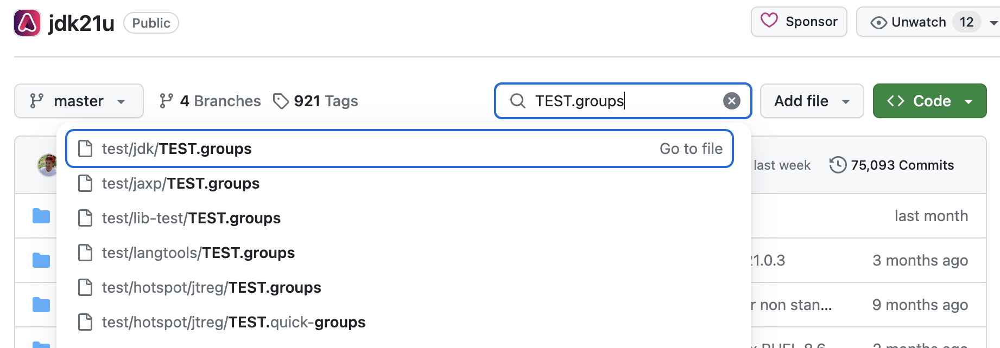
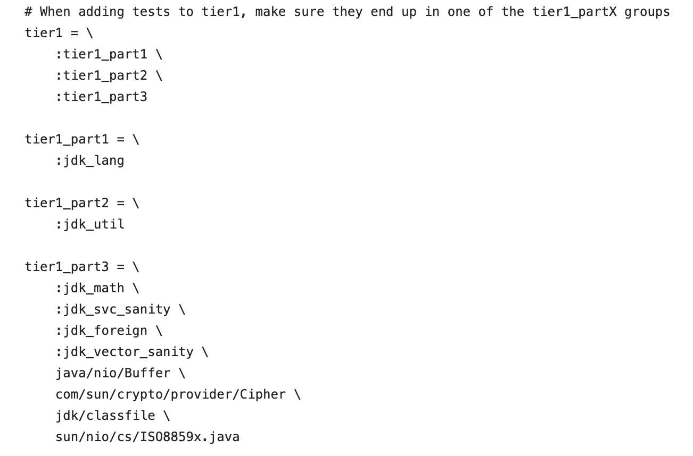
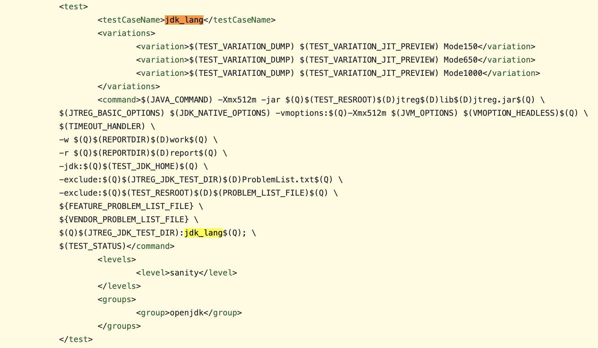
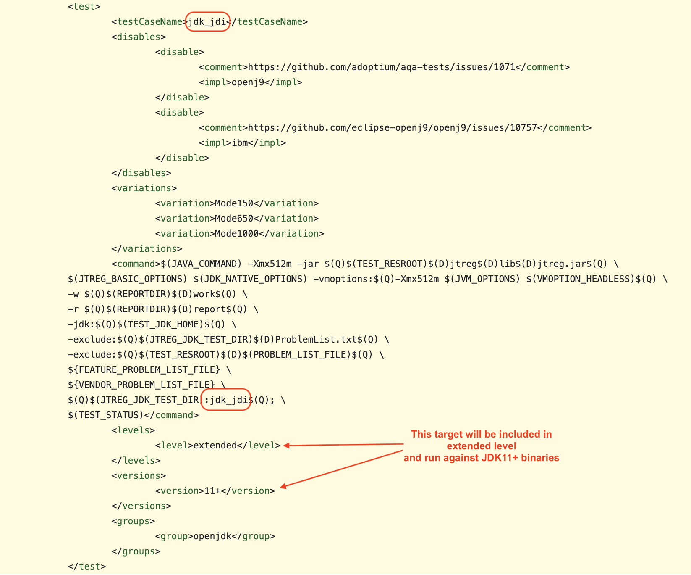

# How OpenJDK tests map to AQAvit test targets

---

#### Quick Take on Top-level AQAvit Targets

See [AQAvit terminology](https://github.com/adoptium/aqa-tests/wiki/AQAvit-Terminology) for a more detailed reference to common AQAvit terms used below.

- **sanity.openjdk** equals most of tier1 (with the exception of langtools tier1 targets) which equates to ~5058 testcases for most platforms
- **extended.openjdk** equals most of tier2, tier3 and some tier4 which equates to an additional ~12633 testcases for most platforms

#### Mapping of Terminology

Tests within the OpenJDK project are divided into tiers. tier1, tier2, tier3, etc. which are made up of smaller make targets defined in the TEST.groups file in the upstream repositories. For example, in the Adoptium mirror of jdk21u, you can find where these are defined by going to any of the TEST.groups files (seen below).

---

Looking at a test/jdk/TEST.groups example from jdk21u, one can see how the various tiers are comprised of a set of smaller make targets such as the ([tier1 example](https://github.com/adoptium/jdk21u/blob/master/test/jdk/TEST.groups#L39-L59)).

Because we want the flexibility to 'slice and dice' the AQAvit automated testing in various ways, we create a 1-for-1 mapping to the smaller make targets defined in those TEST.groups files. You can see within the AQAvit definition files, a.k.a. playlist files, that the test targets for the openjdk group are named the same as the upstream targets and are mapped to those targets.

For example, one can see that the [jdk_lang](https://github.com/adoptium/aqa-tests/blob/master/openjdk/playlist.xml#L716-L742) target defined in the [aqa-tests/openjdk/playlist.xml](https://github.com/adoptium/aqa-tests/blob/master/openjdk/playlist.xml) file directly calls the jdk_lang target of the upstream repository in the command that is executed during the test run.

---

Since we only need 1 playlist file that covers all versions of the JDK, in cases where the upstream repository has removed or changed the test make targets from one version to another, this is handled by adding a second definition into the playlist file and limiting the version scope for which it applies. For example, the jdk_jdi target is in tier1 in jdk8u, but from jdk11+ is moved to tier3. In attempting to keep sanity.openjdk equivalent to tier1, it is handled by having 2 targets in the playlist file, [jdk_jdi_jdk8](https://github.com/adoptium/aqa-tests/blob/master/openjdk/playlist.xml#L1510) which is used when running against a jdk8 binary and runs as part of the sanity.openjdk top-level target and [jdk_jdi](https://github.com/adoptium/aqa-tests/blob/master/openjdk/playlist.xml#L1704) which is used when running against jdk11+ binaries and runs as part of the extended.openjdk top-level target.

