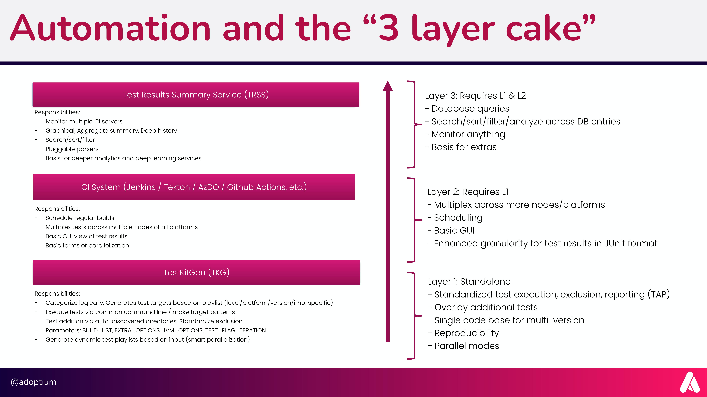

## Why AQAvit Uses the '3 Layer Cake' Architecture

The Adoptium Quality Assurance (AQA) process plays a crucial role in ensuring the reliability, stability, and security of OpenJDK builds distributed by the Eclipse Adoptium project. AQA employs the '3 Layer Cake' architecture, consisting of three layers - Test Result Summary Service (TRSS), CI Systems, and TaskKitGen (TKG). This documentation explores the rationale behind the adoption of the '3 Layer Cake' architecture and its significance in delivering high-quality Java runtimes.

### Overview of the '3 Layer Cake' Architecture:

The '3 Layer Cake' architecture in Adoptium AQA comprises three interconnected layers, each responsible for specific aspects of testing and build validation:

- **Test Result Summary Service (TRSS):** TRSS serves as the top layer and is responsible for monitoring multiple CI servers, generating graphical aggregate summaries, providing deep historical data, and offering search, sort, and filter capabilities. It also supports pluggable parsers, forming the basis for deep analytics and deep learning services.

- **CI Systems:** The middle layer consists of various Continuous Integration (CI) systems such as Jenkins, Tekton, Azure DevOps (AzDo), GitHub Actions, and others. CI systems schedule regular builds, distribute tests across multiple nodes and platforms, and provide basic GUI views of test results. They also enable basic forms of parallelization.

- **TaskKitGen (TKG):** The bottom layer, TKG, categorizes logically, generates test targets based on playlists (level/platform/version/implementation-specific), and executes tests via common command-line or make target patterns. TKG adds tests through auto-detected directories, standardizes exclusion, and dynamically generates test playlists for smart parallelization.

### The Rationale Behind '3 Layer Cake' Architecture:

The adoption of the '3 Layer Cake' architecture in Adoptium AQA is driven by several key reasons:

- **Modular Testing Approach:** The '3 Layer Cake' architecture provides a modular testing approach, dividing responsibilities among three layers. This modularity allows for easy maintenance, upgrades, and improvements of individual layers, promoting flexibility and adaptability to evolving testing needs.

- **Comprehensive Testing Coverage:** Each layer in the architecture addresses specific aspects of testing. TRSS focuses on summary services and deep analytics, CI Systems handle continuous integration and basic GUI views, and TKG is responsible for test categorization and execution. This layered approach ensures comprehensive testing coverage of OpenJDK builds.

- **Efficient Bug Resolution:** The architecture's layered design allows for efficient bug resolution. Issues identified in a specific layer can be isolated and addressed within that layer, streamlining the bug-fixing process and reducing turnaround time.

- **Scalability and Platform Flexibility:** The '3 Layer Cake' architecture can scale effortlessly to accommodate varying testing requirements and support multiple CI systems. Its platform flexibility ensures compatibility with different operating systems, architectures, and cloud environments, enhancing the build's portability.

- **Data-Driven Decisions:** The TRSS layer provides graphical aggregate summaries and deep historical data, enabling data-driven decisions in the AQA process. This data-driven approach allows the AQA team to monitor trends, identify patterns, and make informed decisions for further improvement.

### In Conclusion:
The '3 Layer Cake' architecture employed in Adoptium AQA is a strategic choice that enhances the reliability, scalability, and efficiency of the testing process for OpenJDK builds. By dividing responsibilities among TRSS, CI Systems, and TKG, Adoptium AQA achieves comprehensive testing coverage, modularity, and platform flexibility. This architecture ensures the delivery of high-quality Java runtimes, reinforcing the Eclipse Adoptium project's commitment to excellence and building trust among developers and users worldwide.