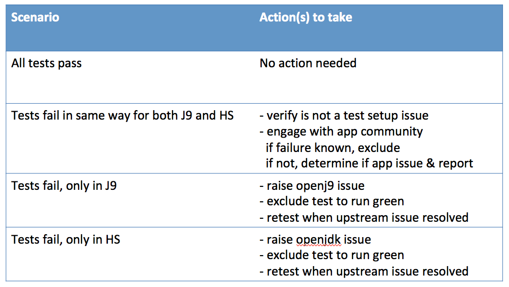

# Third Party Container Tests

Third Party container tests help verify that the AdoptOpenJDK binaries are *good* by running a variety of Java applications inside of Docker containers. AdoptOpenJDK/openjdk-tests/[Issue #172](https://github.com/AdoptOpenJDK/openjdk-tests/issues/172) lists the applications that we have initially targeted to best exercise the AdoptOpenJDK binaries.  For each application, we choose to run a selection of their functional tests.  

When [running these from the command-line](https://github.com/AdoptOpenJDK/openjdk-tests/blob/master/doc/userGuide.md#local-testing-via-make-targets-on-the-commandline), these tests are grouped under a make target called 'external', so 'make external' would run the entire set of tests found in the openjdk-tests/external directory.  These tests run nightly and can be found in the [Test_external view](https://ci.adoptopenjdk.net/view/Test_external/) at ci.adoptopenjdk.net.

See the [roadmap](https://github.com/AdoptOpenJDK/openjdk-tests/tree/master/external#roadmap) for additional ways we plan to expand this approach.

### Roadmap
Our next steps to improve and expand this set of external tests is divided into 2 categories:
#### Technical Goals
- Copy results from Docker container for easier viewing in Jenkins 
- Quick compare view, easy comparison of how different implementations stack up
- Parallel testing (to improve execution time)
- Startup-only testing (application startup, but not full runs of app functional testing)
- Add high-value tests that exercise the AdoptOpenJDK binaries, including but not limited to functional test suites and Microprofile compliance tests (plan to start with [Fault Tolerance TCK](https://github.com/eclipse/microprofile-fault-tolerance/blob/master/tck/running_the_tck.asciidoc) and [Metrics API TCKs](https://github.com/eclipse/microprofile-metrics/blob/master/tck/running_the_tck.asciidoc) against [GlassFish](https://javaee.github.io/glassfish/) EE reference implementation) 
 
#### Strategic Goals
- Engage with application communities, including the Eclipse Jakarta EE project, to:
    - report and resolve application test failures
    - get more involvement with testing AdoptOpenJDK binaries
    - encourage use of AdoptOpenJDK binaries, add extra OpenJDK versions and variants in their build farms

### Triage Rules
There are 4 common triage scenarios, with associated appropriate actions to take:

### How to Add New Tests
- Learn how to run the application tests that you intend to automate in the build manually first, and find out any special dependencies the application testing may have.
- Clone https://github.com/AdoptOpenJDK/openjdk-tests.git and look at external directory.
- Copy the 'example-test' subdirectory and rename it after the application you are adding. 
- Modify the files in your new sub-directory according to your needs. 
- Check in the changes into https://github.com/[YOUR-BRANCH]/openjdk-tests and test it using a <a href="https://github.com/AdoptOpenJDK/openjdk-tests/wiki/How-to-Run-a-Personal-Test-Build-on-Jenkins">personal build</a>. 

#### Which files do I need to modify after making a copy of example-test?

**Dockerfile**
- The example Dockerfile contains a default list of dependent executable files. Please read the documentation of the third party application you are enabling to find out if you need any executable files other than the default set, if yes, add them to the list.   
- Update the clone command based on your third party application's source repository.
 
 **Shell script**
- Replace the example command line at the bottom of this script with the initial command lines that trigger execution of your test.

**build.xml** 
- Update the distribution folder paths, docker image name etc according to the name of your application. 

**playlist.xml** 
- Update the name of the example test case to the actual test case of the third party application that you intend to run. 

Please direct questions to the [#testing Slack channel](https://adoptopenjdk.slack.com/messages/C5219G28G).