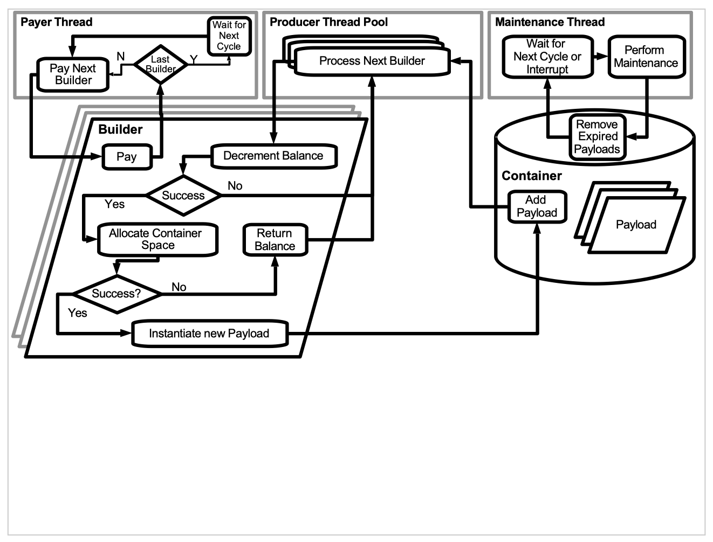
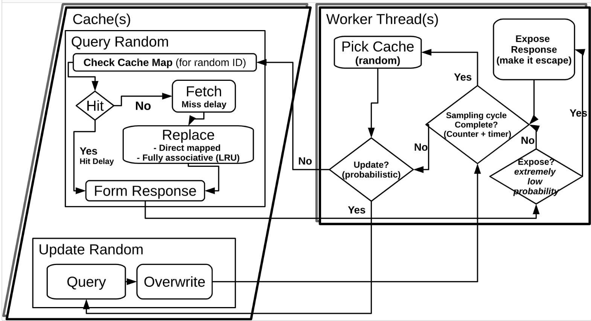

# A Multi-Threaded Tunable Synthetic GC Workload
 
## 1 - The Sessions Workload Application

###  1.1 - Motivation and Approach

Percolate collections and aborts are very costly occurrences in the J9 GC. Unfortunately they are sometimes seen on production systems running J9 and may lead to significant performance issues.

Due to the inherent difficulties in reproducing the real-world conditions under which these issues often occur, they can be very difficult to debug. It is therefore desirable to find an alternate means by which we can replicate similar conditions in a controlled test environment.

A synthetic workload was therefore devised in order to facilitate the debugging of these problems and the formulation of solutions. In order to find a simple set of parameters which can reproduce a given issue, a synthetic workload was devised, allowing the developer to specify a allocation and reference change patterns.

The results can then be monitored using an included verbose GC parser which monitors the effects of the workload on the garbage collector. Comparing these results to results from the customer’s system allows
the development of a workload that closely replicates the customer’s problem and allows the development of a targeted and tested solution.

### 1.2 - Design

The Synthetic GC Workload provides a framework for the construction of custom allocation and reference change scenarios, specified by an XML configuration file. Each configuration specifies one or more workloads which run simultaneously. Each workload has a hard runtime, after which it will terminate. Repetition of workloads and payloads is also supported.

Payloads are specified within each workload, each having a size, a finite lifespan and constituting a certain proportion of allocations. Payloads also have a type and may be either arrays of certain primitives or instances of runtime-generate reflexive classes.

Payloads are grouped into payload sets, each set having a start time, an end time and a data rate. The data rate is divided among any directly nested payloads according to their proportion fields and is inherited by any subsets. Subsets may override any parameters specified in parent sets. Payloads may inherit certain parameters from their parent set including their type.


##### *Figure 1: A simplified overview of the execution of a Sessions workload configuration


### 1.3 - Implementation

The implementation of the workload follows a producer-consumer design. An atomic linked list of payloads serves as a container. The list is walked at a fixed interval by a maintenance thread. The maintenance thread removes any expired payloads.

The producer side consists of a payer thread which distributes tokens to (or pays) builders. A producer thread pool performs the allocations themselves. Builders initially begin with zero balance in order to avoid any initial burst of allocation. Builders are paid based on the time elapsed during the last payment cycle.

Cycle payment is adjusted by a small factor if the average allocation rate differs from the target rate.

Each builder will spawn one or more allocation tasks on the thread pool when its balance (the ”number” of tokens it possesses) is sufficient. This algorithm is similar to the token bucket-style algorithm, often used for network bandwidth allocation.

When the payment interval is small, the payment and allocation rates are consistent. Additionally, short maintenance intervals allow for more precise payload lifespans. Both come at the cost of additional CPU usage.

### 1.4 - Usage

With the JAR file in the current directory, a synthetic workload configuration is executed as follows:
```
$ java -cp .:SyntheticGCWorkload.jar net.adoptopenjdk.casa.workload_sessions.Main <config file> [options]
```

__In order to use reflexive payloads, the current directory must be in the class path and must be writable.__ 

The majority of configuration is done via the XML configuration file, specified on the command line at runtime. Table 2 lists other command line options which may be specified at runtime.

Table 1 gives an example configuration file. This configuration contains one workload which runs for 10 minutes, and uses a 4-thread producer pool. It is worth noting that nesting configurations unnecessarily may not produce desirable results. 

The payer thread and maintenance thread are both set to run at an interval of one microsecond, allowing for high resolution timing of allocation and reference changes (\*_Note_\*  that having very short intervals for either of these values uses more computer resources). Output is printed by the status thread every second, providing a running tally of payment rate, allocation rate, live-set size, free heap space and elapsed time.

```
<?xml version="1.0" encoding="ISO-8859-1"?>
<configuration maxDuration="10m">
	<workload duration="10m" numProducerThreads="4"	paymentPeriod="1us" maintenancePeriod="1us">	

		<payloadSet startTime="0" endTime="20s" dataRate="20MB/s" payloadType="auto">
			<payload proportionOfAllocation="50%" size="10kB" lifespan="1h" />				
			<payload proportionOfAllocation="50%" size="10kB" lifespan="22s" />						
		</payloadSet> 	

		<payloadSet startTime="15s" dataRate="18MB/s" payloadType="auto">																				
				<payload proportionOfAllocation="30%" size="12.5kB" lifespan="14s"/>
				<payload proportionOfAllocation="50%" size="12.5kB" lifespan="8s"/>
				
				<payload proportionOfAllocation="3%" size="11kB" lifespan="18s"/>
				<payload proportionOfAllocation="7%" size="11kB" lifespan="8s"/>
				
				<payload proportionOfAllocation="3%" size="9kB" lifespan="19s"/>
				<payload proportionOfAllocation="7%" size="9kB" lifespan="8s"/>					
		</payloadSet>

	</workload>
</configuration>
```
##### *Table 1: An example workload configuration


The workload in Table 1 contains 2 top level payloadSet tags. Payment to the first set starts at t=0 and runs for 20s. Payment to the second starts at 15s and runs until completion. Nesting payloadSets may be used with caution.

The first set also specifies the payloadType as auto. Auto will use runtime-generated reflexive payloads up to a predetermined point where their source is unreasonably long. For any larger payloads, one of the array types will be used.
       
#### Command line options       
The following command line options can be specified:

Short |   Long    | Description | Example
------|--------|-------------|--------
-l | --logfile| Specify a file to send workload output to | --logfile log.txt
-s | --silent |  Don’t print output to the console | -ls log.txt (Sends output to file instead of the console)
-n | --use-newlines | Follow status updates to the console with newlines. Overrides default behavior of overwriting the previous update. | 
-h | --help |  Print usage information | 

##### *Table 2: Command line options supported by the Synthetic GC Workload

Figure 3 represents the possible options within the xml configuration files, and a description of what each tag does.

<table style="width:100%">
<caption><strong>Sessions Configuration File Structure</strong></caption>
  <tr>
    <th>Element</th>
    <th>Parameter</th> 
    <th>Description</th>
  </tr>

  <!-- When adding a row, modify the rowspan param -->

  <tr>
    <td rowspan="3">configuration</td>
  </tr>
  <tr>
    <td>maxDuration</td> 
    <td>The program will terminate after this period of time, regardless of the      status of the running workloads.
        Must be a non-zero time.</td>
  </tr>
  <tr>
    <td>statusUpdatePeriod</td> 
    <td>Time the status thread sleeps after printing an update. Must be a time unit or 0 for no regular updates. </td>
  </tr>
    
  <tr>
    <td rowspan="6">workload </td>
  </tr>

  <tr>
    <td>duration</td> 
    <td>The workload will terminate after this period of time. Optional, will inherit maxDuration if absent. </td>
  </tr>
  <tr>
    <td>startTime</td> 
    <td>The time at which the workload should start. This represents t = 0 for
        all sets in the workload</td>
  </tr>
  <tr>
    <td>numProducerThreads</td> 
    <td>Specifies the number of threads in the PayloadBuilderThreadPool. When set to ”auto”, will resolve to the number of hardware threads divided by the number of workloads</td>
  </tr>
  <tr>
    <td>paymentPeriod</td> 
    <td>The time the payer thread sleeps after each payment cycle</td>
  </tr>
   <tr>
    <td>maintenancePeriod</td> 
    <td>Time the maintenance thread sleeps after walking the container</td>
  </tr>


<tr>
    <td rowspan="8">payloadSet </td>
  </tr>

  <tr>
    <td>startTime</td> 
    <td>Time to start paying this set; default is 0. Must be a time unit if present and non-zero. </td>
  </tr>
  <tr>
    <td>endTime</td> 
    <td>Time (from the beginning of the workload) to stop paying this set; default is the end of the workload. Must be a time unit if present and non-zero.</td>
  </tr>
  <tr>
    <td>type</td> 
    <td>The default type for payloads, or 'auto' to select an appropriate type automatically.</td>
  </tr>
  <tr>
    <td>dataRate</td> 
    <td>Data rate for this set. Must be a nonzero data rate unit. Data rate can be specified per thread with the suffix ”/thread”</td>
  </tr>
   <tr>
    <td>numPayloadContainerLists</td> 
    <td>The number of separate lists
        the container should split the Payloads up into. By default this is 256 times the number of available processors. This option improves GC parallelism on some VMs and system</td>
  </tr>
  <tr>
    <td>repetitionDelay</td> 
    <td>The delay at which a payload "burst" will be repeated. If this option is used, a 'duration' must also be specified in the payloadSet. Default is to only execute the payloadSet/payloads once. View section 1.7 for details</td>
  </tr>
  <tr>
    <td>duration</td> 
    <td>The length of a payload "burst". If this option is used, a 'repetitionDelay' must also be specified in the payloadSet. Default is to "burst" only once, for the time between startTime and endTime.</td>
  </tr>

<tr>
    <td rowspan="9">payload </td>
  </tr>

  <tr>
    <td>type</td> 
    <td>Type of the payload, or auto to select a type based on size, sizeRadius and sizeVariance. </td>
  </tr>
  <tr>
    <td>proportionOfAllocation</td> 
    <td>The proportion or percentage of set’s data rate. Proportions are automatically scaled such that the total in each set equals 100%</td>
  </tr>
  <tr>
    <td>size</td> 
    <td>The size of the payload, or the mean size if random. • Must be a nonzero data size unit.</td>
  </tr>
  <tr>
    <td>sizeRadius</td> 
    <td>Radius can be supplied for random and Gaussian types. </td>
  </tr>
   <tr>
    <td>sizeVariance</td> 
    <td>For Gaussian types; see Table5 for details. If nonzero, must be a valid data size unit</td>
  </tr>
  <tr>
    <td>lifespan</td> 
    <td>The time the payload should remain part of the live set. Must be a non-zero time unit. Add a nonzero lifespanRadius for a flat random lifespan. Add nonzero lifespanRadius and lifespanVariance for a Gaussian distributed lifespan.</td>
  </tr>
  <tr>
    <td>lifespanRadius</td> 
    <td>The range over which the lifespan can be randomly selected. If this parameter is set to 0 or is absent, the lifespan will not be random. If nonzero, must be a valid time unit.</td>
  </tr>
   <tr>
    <td>lifespanVariance</td> 
    <td>The variance for the Gaussian distribution of lifespan. If set to 0 or absent and lifespanRadius present and nonzero, a flat random distribution is used. If nonzero, must be a valid time unit.</td>
  </tr>

</table>

#### *Table 3: Sessions Configuration File Structure


### 1.5 - Output

[exampleSessionsOutput.txt](doc/exampleSessionsOutput.txt) provides an example of the output generated by running the configuration listed in Table 1. The last line is continually updated throughout the run. It provides elapsed time, total average pay rate for active sets, average allocation rate, container usage, total throughput and free heap information. It also displays a readout of the number of queued allocation tasks.

For each payload, we can see additional information such as the period (time between two allocations), the peak live set size of that payload and the time at which it is expected to reach its peak size. For each set, we see the set’s expect peak usage and the time at which it is expected to peak.

It should be noted that the maintenance interval is taken into account when making these calculations, as a payload is not expected to live for less than one maintenance interval. There are, however, two cases where this may occur: first, when the container is full, an interrupt will trigger a maintenance cycle; second, if the payload expires before it can be added to the container, it will not be added but instead will be released prior to addition. 

### 1.6 - JavaAgent

The syntheticGCWorkload can be run as a _javaagent_.  When run as a java agent, the appropriate main method (caching or sessions main) is started, and runs along side of the regular java application we are instrumenting. The main advantage of running SGCW(Synthetic GC Workload) as an agent, is that SGCW and the other application are sharing the same resources (heap, etc) as they are being run __in the same JVM__. A possible use case for using this, is to observe how additional object allocations (those coming from SGCW) affects the performance of the regular application, which can put different stress on the GC/VM.

To run SGCW as a javaagent, the following command line can be used:

Running the __sessions__ workload:

    $ java -Xbootclasspath/a:. -javaagent:SyntheticGCWorkload.jar="-s <config file> [options]" -jar <app.jar> [app options]
    
Running the __caching__ workload:

    $ java -Xbootclasspath/a:. -javaagent:SyntheticGCWorkload.jar="-c <config file> [options]" -jar <app.jar> [app options]
<br>

## 1.7 - Repetition Delay

If a given payload needs to be repeated at certain intervals, this can be done using the __"repetitionDelay"__ keyword.

Consider an example where we want to repeat a certain payload every 15 seconds. This payload will start at t=10s, needs to allocate for 5 seconds, and the payload needs to completely stop after 60s. The following <__payloadSet__> can be configured: 

```
<payloadSet startTime="10s" duration="5s" repetitionDelay="15s" endTime="60s" dataRate="5MB/s" payloadType="reflexive">
    <payload proportionOfAllocation="5%" size="80B" lifespan="0ms" />
    <payload proportionOfAllocation="20%" size="192B" lifespan="0ms" />
    <payload proportionOfAllocation="25%" size="256B" lifespan="0ms" />
    <payload proportionOfAllocation="50%" size="640B" lifespan="0ms" />
</payloadSet>
```        

By setting the following fields
- startTime="10s"
- duration="5s"
- repetitionDelay="15s"
- endTime="60s"

We obtain the following allocation pattern: 5Mb/s allocations between times 10-15, 25-30, 40-45, 55-60.

Further use of this keyword can be seen in [config_repetitionDelayExample.xml](config/config_repetitionDelayExample.xml).

### A few important notes regarding repetition delays: ###
- A repetitionDelay is relative to the __startTime__ of a payloadSet, not the endtime. 
- An error will be thrown if a payloadSet with a repetition delay is nested within another payloadSet, or if the payloadSet contains any child payloadSets. In essence, repetitionDelay 's do not work when involved in any sort of payloadSet nesting

## 2 - Caching Workload

### 2.1 - Motivation and Approach

The caching workload application is designed to simulate the behavior of a database cache. It is designed to provide very precise feedback on GC throughput in the form of realtime logging. 

Configuration involves specifying a number of artificial database tables to cache, each with a specified hit rate and a particular cache size. Transactions which are performed on the cached tables consist of queries and updates. The ratio of queries to updates can be configured and the operations are chosen at random. Hit and miss delays are also configurable to improve realism.

This application is designed to be highly salable, specifically to support massively multicore POWER 8 machines. As such, it scales well up to and beyond 128 threads, depending on available hardware.

### 2.2 - Design

The caching workload is designed to achieve a high rate transactions on the caches by a very large number of threads. It also is capable of logging real-time instantaneous throughput down to a granularity of 1ms.



#### *Figure 2: A simplified overview of the Caching workload configuration


### 2.3 - Usage

The format of the caching XML configuration is detailed in table 4. In each configuration file, multiple cache simulations may be added and these simulations will run in parallel. 

Example command line: 
```
$ java net.adoptopenjdk.casa.workload_caching.Main -h
```
or 
```
$ java -cp SyntheticGCWorkload.jar net.adoptopenjdk.casa.workload_caching.Main -h
```

This command line will display all command line options (options are related to logging/output)


The following table (table 4) details the configuration options for caching workloads.


<table style="width:100%" >
    <caption><strong>Caching Configuration File Structure</strong><caption>
  <tr>
    <th>Element</th>
    <th>Parameter</th> 
    <th>Description</th>
  </tr>

  <!-- When adding a row, modify the rowspan param -->

  <tr>
    <td rowspan="2">configuration </td>
  </tr>
  
  <tr>
    <td>[None]</td> 
    <td>Top level element. Contains table</td>
  </tr>


  <tr>
    <td rowspan="4">cacheSimulation </td>
  </tr>
  
  <tr>
    <td>startTime</td> 
    <td>The time after which the simulations threads should be started</td>
  </tr>
  <tr>
    <td>duration</td> 
    <td>The simulation will terminate
        this amount of time after the threads have started.</td>
  </tr>
  <tr>
    <td>numThreads</td> 
    <td>The number of threads the
        simulation should start. Threads operate on all caches in the simulation.</td>
  </tr>


   <tr>
    <td rowspan="9">table <br>(describes table to be cached)</td>
  </tr>
  
  <tr>
    <td>cacheType</td> 
    <td>The type of cache mapping
        to be used. Supported mappings are direct mapped hash, direct mapped array, and fully associative</td>
  </tr>
  <tr>
    <td>rowSize</td> 
    <td>The size of each row in the
        imaginary table. Default is 128B.</td>
  </tr>
  <tr>
    <td>hitRate</td> 
    <td>The target hit rate, used in
        sizing the imaginary table.</td>
  </tr>
    <tr>
    <td>cacheSize</td> 
    <td>The heap size of the cache when
        fully populated, including all overhead. </td>
  </tr>
  <tr>
    <td>updates</td> 
    <td>The proportion of transactions
        which should be updates (vs. queries), given as a percentage or a proportion < 1</td>
  </tr>
    <tr>
    <td>hitDelay</td> 
    <td>Amount of time to delay after
        a cache hit</td>
  </tr>
  <tr>
    <td>missDelay</td> 
    <td>Amount of time to delay after a
        cache miss.</td>
  </tr>
   <tr>
    <td>responseSize</td> 
    <td>The number of bytes to copy
        from the row and to perform processing (simple sum) on after each query.</td>
  </tr>

</table>

#### table 4: Caching Configuration File Structure  
  

The following is an example configuration file for the caching workload: 
```
<?xml version="1.0" encoding="ISO-8859-1"?>
<configuration>
<cacheSimulation duration="1s" numThreads="4" >
<table
rowSize="50B"
hitRate="90%"
cacheSize="16MB"
responseSize="20B" />
</cacheSimConfiguration>
</configuration>
```

This configuration spawns 1 cache of 16MB size with a hit rate of 90%. The row size is 50B and 20B of that is involved in the query calculation. 4 threads continuously query this table through the cache.

Example usage: 
```
$ java -Xms4g -Xmx4g net.adoptopenjdk.casa.workload_caching.Main cache_sim_config.xml -t throughput.log -g 100ms -w 300ms -W 1s
```
Output:
```
=========================================================
 J9 Synthetic Garbage Collection Workload - Caching
=========================================================
---------------------------------------------------
| CACHE SIMULATION         |
| Start time               |
| End time                 |
| Duration                 |
| Worker Threads           |
--------------------------------------------------------------------------------------------------------
| Table  | Rows     | Row Size | Hit %  | Cache Rows (Size) | Response | Update % | Hit    | Miss   | Ca
--------------------------------------------------------------------------------------------------------
|    1.1 |   175862 |    50.0B |  90.0% |   158276 (20.8MB) |    24.0B |    0.00% |      0 |      0 |
--------------------------------------------------------------------------------------------------------
| 2.79ms/3.00s |>                        | 0%      | 3.50GB | 0tr/s
2015-04-29T15:21:34.447: NOTICE: simulation 1: starting threads...
| 1.00s/3.00s |=======>                | 33%      | 3.26GB | 0tr/s
2015-04-29T15:21:35.705: NOTICE: simulation 1: all threads started.
| 2.01s/2.26s |====================>   | 88%      | 3.38GB | 1tr/s
---------------------------------------------------
| CACHE SIMULATION         |                           1|
| Total Transactions       |                    2469440 |
| Mean Transaction Time    |                1.5993503us |
|   Standard Deviation     |                716.71762ns | 
| Average Throughput       |              2466896.1tr/s |
|   per Thread             |              616724.02tr/s |
---------------------------------------------------
| % OF TRANSACTIONS        | COMPLETE WITHIN      |
---------------------------------------------------

|                   99.999% |              21.0us |
|                   99.990% |              21.0us |
|                   99.900% |              8.91us |
|                   99.000% |              2.84us |
|                   95.000% |              2.13us |
|                   90.000% |              2.13us |
|                   50.000% |              1.60us |
--------------------------------------------------- 
|TableID     |Hits       |Misses      |HitRate |   
---------------------------------------------------
|       1.1 |    2222132 |     247308 |     90.0% |
---------------------------------------------------
```


## 3 - Further Reading

Additional documentation, including the verbose GC Analysis tools documentation, more in depth configuration options for both sessions and caching workload, documentation regarding available time/data units, and more, can be found in the [full documentation](doc/SyntheticGCWorkloadDocumentation.md)