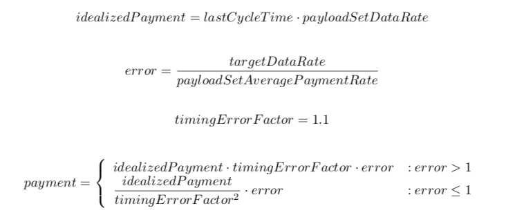

# A Suite of Multi-Threaded Tunable Synthetic GC Workloads

IBM Center for Advanced Studies Atlantic
University of New Brunswick, Fredericton
Sub-Project: Performance of Benchmarks
March, 2015

Andrew Somerville
Research Assistant

## Contents

- 1 The Sessions Workload Application
   - 1.1 Typical Workflow
   - 1.2 Design and Implementation
      - 1.2.1 The PayloadSuper-Class
      - 1.2.2 The PayloadContainer
      - 1.2.3 The PayloadBuilder and PayloadBuilderSetInstances
      - 1.2.4 The PayerThread
      - 1.2.5 The PayloadBuilderThreadPool.
      - 1.2.6 The MaintenanceThread
   - 1.3 Configuration and Usage
   - 1.4 Output
   - 1.5 Repetition Delay
- 2 The Caching Workload Application
   - 2.1 Typical Workflow
   - 2.2 Design
   - 2.3 Usage
      - 2.3.1 Throughput Logging
   - 2.4 Command Line Arguments
- 3 Verbose GC Analysis Tools
   - 3.1 Verbose GC Tailer
      - 3.1.1 Command Line Arguments
   - 3.2 Verbose GC Parser
      - 3.2.1 Command Line Arguments
   - 3.3 Verbose GC Comparator
      - 3.3.1 Command Line Arguments
- 4 Additional Tables      


## 1 The Sessions Workload Application

Percolate collections and aborts are very costly occurrences in the J9 GC. Unfortunately they are sometimes seen on production systems and may lead to significant performance issues for J9 customers.

Due to the inherent difficulties in reproducing the real-world conditions under which these issues often occur, they can be very difficult to debug. It was therefore desirable to find an alternate means by which we can replicate similar conditions to those seen in a production system in a more controlled test environment.

A synthetic workload, called Sessions, was devised in order to facilitate the debugging of these problems and the formulation of solutions. Sessions is designed to simulate an application whose runtime is finite and may consist of several phases. Typically this will include a start-up phase and a running phase with the
start-up phase allocating long-lived, persistent objects and the running phase allocating a mix of short-lived small objects and somewhat longer-lived objects of all sizes. The goal is to produce a realistic facsimile of a Java program’s behavior with regard to liveliness and object sizes.

### 1.1 Typical Workflow

Starting with a client’s verbose GC log, a J9 developer can use the Sessions application to produce similar allocation, object size and liveliness patterns to those seen in the log. The tuned Sessions configuration allows the J9 developers to reliably reproduce problems seen in production systems in a more controlled debugging scenario and to regression test future releases.

The results can be monitored using an included verbose GC parser, compared to the original, or compared to an earlier set of results to track regression or improvement over time. This parser can monitor the effects of the workload on the garbage collector in real-time, accelerating development, or on the completed log file after the workload is completed. Comparing these results to those from the customer’s system allows the further tuning of the Sessions workload configuration and the development of effective workarounds.

### 1.2 Design and Implementation

The Sessions workload provides a framework for the construction of custom allocation and reference change scenarios, specified by an XML configuration file. Each configuration specifies one or more workloads which run simultaneously. Each workload has a start time and a hard run-time, after which it will terminate.
All times within a workload are referenced from its start time, and the start time is referenced from the workload application’s start time.

Payloads are specified within each workload, each having a size and a finite lifespan. Payloads may be arrays of certain primitives or instances of runtime-generated reflexive classes. Payload sizes and lifespans may be specified as single values or may be taken from range-limited Gaussian or flat random distributions.

Payloads are grouped into one or more sets. Each set has a start time, an end time, a default payload type and a data rate. Each set’s start and end time are referenced from the actual start time of the workload.
The data rate is divided among any directly nested payloads according to their proportionOfAllocation fields and is inherited by any subsets. Subsets may override the data rate and default payload type of their parent sets. Payloads may inherit certain parameters from their parent set including their default type.

One of the core design goals was to provide tight control over allocation and liveliness with a high degree of temporal accuracy. This goal necessitated the universal use of atomic structures for synchronization and the absence of any extraneous heap allocation associated with payload allocation.

The implementation follows a three-stage pipe-lined producer-consumer design, a simplified version of which is found in Figure 1.


#### *Figure 1: A simplified overview of the execution of a Sessions workload configuration

<br>

1. Payment - the distribution of balance in accordance with each payloadSet’s dataRate and each
    payload’s proportionOfAllocation.
2. Allocation and instantiation of payloads - new payloads are instantiated and placed in the appropriate
    container.
3. Maintenance - the containers are traversed and expired payloads are removed.


#### Table 1: The pipeline stages of a Sessions workload

Please note that the allocation phase was removed as was the container size option in recent versions. The three pipeline stages are outlined in Table 1. Stage 1 consists of the PayerThread, connected to Stage 2 via PayloadBuilderSet instances. Each PayloadBuilderSet contains one PayloadBuilder for each configured payload within the corresponding payloadSet. Occurrences of
payloadSet containing no immediate payload configurations have no correspondingPayloadBuilderSet instance.

Stage 2 consists of a thread pool, thePayloadBuilderThreadPool(formerly called the Producer Thread Pool), which instantiates new Payload instances and places them in the PayloadContainer corresponding to the set containing the payload when balance is available. Finally, Stage 3 consists of theMaintenanceThread which removes expired payloads from the container.

Each workload in a configuration will have its ownPayerThread, PayloadBuilderSet instances and PayloadBuilderThreadPool. Each PayloadBuilderSet has its own PayloadContainer and MaintenanceThread. Each Workload is controlled by a single daemon thread (inWorkloads) which remains in the idle state while the workload is running and wakes up in time to shut down theWorkload.


#### 1.2.1 The PayloadSuper-Class

Each allocated payload extends the Payload super-class. The Payload superclass provides anAtomicReference field for use by thePayloadContainer. An expiration time and a reference to the payload’s configuration are also present in the super-class, allowing the Payload to be managed by the maintenance thread.

Array payloads extendArrayPayload, an abstract subclass of Payload. The overhead of these super-classes is accounted for in calculating the number of instance fields generate or the size of the array and affects the minimum possible payload size for each type.

Reflexive payload classes are identified according to their size and are named according to the pattern GeneratedPayloadSx, where x is the size of the payload in bytes. Since payload lifetimes are dynamic, the lifetime of a payload is determined upon instantiation.

#### 1.2.2 The PayloadContainer

ThePayloadContainers connect Stages 2 and 3 of the pipeline, outlined in Table 1. Each container is an array of atomic linked lists and uses no wrapper objects aside from the Payload super-class itself. This means that adding a Payload to the container or performing maintenance on it creates no additional objects.

Addition is no longer performed in two steps as the container no longer has a fixed size limitation. Instead, payloads can be added to the container. The container also no longer tracks throughput or live set size. Throughput is tracked by each thread individually. The maintenance thread tracks the number of bytes removed from the container. Live set size is calculated by subtracting bytes removed (or never added) from throughput.

The number of lists the each container uses can be set in the set configuration and is inherited from parent sets to child sets. This number defaults to 256p for each container, where p is the number of available processors reported by the VM. Higher numbers of lists facilitate parallel traversal of the object graph by the GC at the cost of overhead.

#### 1.2.3 ThePayloadBuilder and PayloadBuilderSet Instances

Aside from tracking a payload’s balance, aPayloadBuilder encapsulates a callable reference to its associated Payload constructor. During workload initialization, a PayloadBuilder checks that its associated Payload subclass is loaded and that its constructor is available. If the payload class is to be reflexive, ReflexivePayloadCompiler is used to generate, compile and load the payload class uponPayloadBuilder instantiation.

Reflexive Payload classes are compiled under a class name-based lock, as multiple payloads may share the same size and therefore the same Payload class and liveliness is determined upon instantiation.

The set also encapsulates a PayloadContainer which stores live payloads for the set.

#### 1.2.4 ThePayerThread

The rate at which payloads are allocated is controlled by thePayerThread. This thread distributes balance to PayloadBuilder instances, each corresponding to a certain payload configuration.

The PayerThread is configured via the paymentPeriod parameter in each workload configuration. The period can be adjusted down to 1 nanosecond (1ns) for extremely high frequency payment. It can also be set to 0 for continuous payment, consuming 100% CPU. When the payment interval is small, the payment
and allocation rates are more consistent with fewer bursts.

Builders initially begin with zero balance in order to avoid any initial burst of allocation. During a payment cycle, builders are paid based on the time elapsed during the last payment cycle, multiplied by the data rate and finally multiplied by their proportion of allocation within their respective set. Cycle payment
is calculated per-set and is adjusted according to the amount the average payment rate differs from the configured rate for that set. A set’s payment for a cycle lasting _lastCycleTime_ seconds is calculated as follows:




In practice, the payment cycle can be very short, on the order of 1μs or less. Timing overhead means that the lastCycleTime tends to err on the low side. The timingErrorFactor was determined empirically to be just high enough to avoid excessive drift but not so high that it causes over-correction and oscillation. To avoid any burst of high payment during correction and to rapidly correct any over-payment, the timingErrorFactor factor is squared when correcting over-payment.

There is no limit placed on each builder’s balance and balance can accumulate within builders if the data rate is set too high. A warning is issued on workload shutdown indicating which payloads have unused balanced.

#### 1.2.5 ThePayloadBuilderThreadPool.

The PayloadBuilderThreadPool (also known as the Producer Thread Pool) is a fixed-size thread pool employed to instantiate new Payload instances. Each Workload has its own instance ofPayloadBuilderThreadPool.The threads iterate a flat list of builders, pull a fraction of their balance and allocate payloads to them. The balance in builders is never changed by the producer threads and sufficiency is determined by comparing the thread’s per-builder throughput with the thread’s local copy of the builder’s per-thread balance.

Since out of memory conditions often don’t first present with an OutOfMemoryError, any unexpected exception thrown during processing will trigger a shutdown of all workloads.

#### 1.2.6 TheMaintenanceThread

Each container has a maintenance thread, a daemon thread which removes any expired payloads from the container. These threads run at a fixed interval, adjustable via the maintenancePeriod parameter on any workload. This parameter sets the interval for all enclosed sets’ containers. While idle, the maintenance threads may be interrupted in order to trigger an unscheduled maintenance cycle.


The maintenance threads can be configured for continuous operation by setting the maintenance period to 0. They can also be configured to only run when the container is full by setting the period to a value greater than the workload duration. Short maintenance intervals allow for more precise payload lifetimes
but also lead to the consumption of more CPU.


### 1.3 Configuration and Usage


With the JAR file in the current directory, a synthetic workload configuration is executed as follows:
```
$ java -cp .:SyntheticGCWorkload.jar net.adoptopenjdk.casa.workload_sessions.Main <config file> [options]
```


In order to use reflexive payloads, the current directory must be in the class path and must be writable.
Table 2 lists command line options which may be specified at runtime. The majority of configuration is done via the XML configuration file, specified as the first command line option.

Short |   Long    | Description | Example
------|--------|-------------|--------
-l | --logfile| Specify a file to send workload output to | --logfile log.txt
-s | --silent |  Don’t print output to the console | -ls log.txt (Sends output to file instead of the console)
-n | --use-newlines | Follow status updates to the console with newlines. Overrides default behavior of overwriting the previous update. | 
-h | --help |  Print usage information | 


#### *Table 2: Command line options supported by the Synthetic GC Workload

Table 3 gives an example configuration file. This configuration contains one workload which runs for 10
minutes. It uses a 4-thread producer pool and a container that may grow to occupy all free space on the
heap. For a full list of available parameters, see table 4.

```
<?xml version="1.0" encoding="ISO-8859-1"?>
<configuration maxDuration="10m">
	<workload duration="10m" numProducerThreads="4"	paymentPeriod="1us" maintenancePeriod="1us">	

		<payloadSet startTime="0" endTime="20s" dataRate="20MB/s" payloadType="auto">
			<payload proportionOfAllocation="50%" size="10kB" lifespan="1h" />				
			<payload proportionOfAllocation="50%" size="10kB" lifespan="22s" />						
		</payloadSet> 	

		<payloadSet startTime="15s" dataRate="18MB/s" payloadType="auto">																				
				<payload proportionOfAllocation="30%" size="12.5kB" lifespan="14s"/>
				<payload proportionOfAllocation="50%" size="12.5kB" lifespan="8s"/>
				
				<payload proportionOfAllocation="3%" size="11kB" lifespan="18s"/>
				<payload proportionOfAllocation="7%" size="11kB" lifespan="8s"/>
				
				<payload proportionOfAllocation="3%" size="9kB" lifespan="19s"/>
				<payload proportionOfAllocation="7%" size="9kB" lifespan="8s"/>					
		</payloadSet>

	</workload>
</configuration>
```
#### *Table 3: An example workload configuration


The payer thread and maintenance thread are both set to run at an interval of one microsecond, allowing for high resolution timing of allocation and reference changes. Both of these fields accept 0 or a floating point number followed by one of the time units listed in Table 9. Base 60 representations (eg: HH:MM) are
not supported.

Output is printed by the status thread every 1s, providing a running tally of payment rate, allocation rate, live-set size, free heap space and elapsed time. For multiple workloads, payment rate, and allocation rate are summed, while live-set size is shown for each workload. Each status update overwrites the previous one on the console by using a carriage return. This behavior doesn’t extend to--log_file output, where newlines are used instead.

The example workload also contains 2 top level payloadSet tags. Payment to the first set starts at t=0s and runs for 20s. Payment to the second starts at 15s and runs until workload completion. The first set also specifies the payloadType as reflexive. For more information on payload types, see Table 5.

Note that the payloadType in the payload tag itself overrides that of the set.

<table style="width:100%">
<caption><strong>Sessions Configuration File Structure</strong></caption>
  <tr>
    <th>Element</th>
    <th>Parameter</th> 
    <th>Description</th>
  </tr>

  <!-- When adding a row, modify the rowspan param -->

  <tr>
    <td rowspan="3">configuration</td>
  </tr>
  <tr>
    <td>maxDuration</td> 
    <td>The program will terminate after this period of time, regardless of the      status of the running workloads.
        Must be a non-zero time.</td>
  </tr>
  <tr>
    <td>statusUpdatePeriod</td> 
    <td>Time the status thread sleeps after printing an update. Must be a time unit or 0 for no regular updates. </td>
  </tr>
    
  <tr>
    <td rowspan="6">workload </td>
  </tr>

  <tr>
    <td>duration</td> 
    <td>The workload will terminate after this period of time. Optional, will inherit maxDuration if absent. </td>
  </tr>
  <tr>
    <td>startTime</td> 
    <td>The time at which the workload should start. This represents t = 0 for
        all sets in the workload</td>
  </tr>
  <tr>
    <td>numProducerThreads</td> 
    <td>Specifies the number of threads in the PayloadBuilderThreadPool. When set to ”auto”, will resolve to the number of hardware threads divided by the number of workloads</td>
  </tr>
  <tr>
    <td>paymentPeriod</td> 
    <td>The time the payer thread sleeps after each payment cycle</td>
  </tr>
   <tr>
    <td>maintenancePeriod</td> 
    <td>Time the maintenance thread sleeps after walking the container</td>
  </tr>


<tr>
    <td rowspan="8">payloadSet </td>
  </tr>

  <tr>
    <td>startTime</td> 
    <td>Time to start paying this set; default is 0. Must be a time unit if present and non-zero. </td>
  </tr>
  <tr>
    <td>endTime</td> 
    <td>Time (from the beginning of the workload) to stop paying this set; default is the end of the workload. Must be a time unit if present and non-zero.</td>
  </tr>
  <tr>
    <td>type</td> 
    <td>The default type for payloads, or 'auto' to select an appropriate type automatically.</td>
  </tr>
  <tr>
    <td>dataRate</td> 
    <td>Data rate for this set. Must be a nonzero data rate unit. Data rate can be specified per thread with the suffix ”/thread”</td>
  </tr>
   <tr>
    <td>numPayloadContainerLists</td> 
    <td>The number of separate lists
        the container should split the Payloads up into. By default this is 256 times the number of available processors. This option improves GC parallelism on some VMs and system</td>
  </tr>
  <tr>
    <td>repetitionDelay</td> 
    <td>The delay at which a payload "burst" will be repeated. If this option is used, a 'duration' must also be specified in the payloadSet. Default is to only execute the payloadSet/payloads once. View section 1.5 for details</td>
  </tr>
  <tr>
    <td>duration</td> 
    <td>The length of a payload "burst". If this option is used, a 'repetitionDelay' must also be specified in the payloadSet. Default is to "burst" only once, for the time between startTime and endTime.</td>
  </tr>

<tr>
    <td rowspan="9">payload </td>
  </tr>

  <tr>
    <td>type</td> 
    <td>Type of the payload, or auto to select a type based on size, sizeRadius and sizeVariance. </td>
  </tr>
  <tr>
    <td>proportionOfAllocation</td> 
    <td>The proportion or percentage of set’s data rate. Proportions are automatically scaled such that the total in each set equals 100%</td>
  </tr>
  <tr>
    <td>size</td> 
    <td>The size of the payload, or the mean size if random. • Must be a nonzero data size unit.</td>
  </tr>
  <tr>
    <td>sizeRadius</td> 
    <td>Radius can be supplied for random and Gaussian types. </td>
  </tr>
   <tr>
    <td>sizeVariance</td> 
    <td>For Gaussian types; see Table5 for details. If nonzero, must be a valid data size unit</td>
  </tr>
  <tr>
    <td>lifespan</td> 
    <td>The time the payload should remain part of the live set. Must be a non-zero time unit. Add a nonzero lifespanRadius for a flat random lifespan. Add nonzero lifespanRadius and lifespanVariance for a Gaussian distributed lifespan.</td>
  </tr>
  <tr>
    <td>lifespanRadius</td> 
    <td>The range over which the lifespan can be randomly selected. If this parameter is set to 0 or is absent, the lifespan will not be random. If nonzero, must be a valid time unit.</td>
  </tr>
   <tr>
    <td>lifespanVariance</td> 
    <td>The variance for the Gaussian distribution of lifespan. If set to 0 or absent and lifespanRadius present and nonzero, a flat random distribution is used. If nonzero, must be a valid time unit.</td>
  </tr>

</table>

#### *Table 4: Elements and parameters in a workload configuration file.

### 1.4 Output

[exampleSessionsOutput.txt](exampleSessionsOutput.txt) provides an example of the output generated by running the configuration listed in Table 3 to completion. The last line is continually updated throughout the run at the time interval specified by the statusUpdatePeriod parameter in the workload. It provides elapsed time, combined average pay rate (for active sets only), average allocation rate since workload start-up, live set size, total throughput and free heap information.

For each payload, we can see additional information such as the period (time between two allocations), the peak live set size of that payload and the time at which it is expected to reach its peak size. For each set, we see the set’s expected peak usage and the time at which it is expected to peak.

It should be noted that the maintenance interval is taken into account when making these calculations, as a payload is not expected to live for less than one maintenance interval. There are, however, two cases where this may occur: first, when the container is full, an interrupt will trigger a maintenance cycle; second, if the payload expires before it can be added to the container, it will not be added but instead will be released prior to addition.

## 1.5 - Repetition Delay

If a given payload needs to be repeated at certain intervals, this can be done using the __"repetitionDelay"__ keyword.

Consider an example where we want to repeat a certain payload every 15 seconds. This payload will start at t=10s, needs to allocate for 5 seconds, and the payload needs to completely stop after 60s. The following <__payloadSet__> can be configured: 

```
<payloadSet startTime="10s" duration="5s" repetitionDelay="15s" endTime="60s" dataRate="5MB/s" payloadType="reflexive">
    <payload proportionOfAllocation="5%" size="80B" lifespan="0ms" />
    <payload proportionOfAllocation="20%" size="192B" lifespan="0ms" />
    <payload proportionOfAllocation="25%" size="256B" lifespan="0ms" />
    <payload proportionOfAllocation="50%" size="640B" lifespan="0ms" />
</payloadSet>
```        

By setting the following fields
- startTime="10s"
- duration="5s"
- repetitionDelay="15s"
- endTime="60s"

We obtain the following allocation pattern: 5Mb/s allocations between times 10-15, 25-30, 40-45, 55-60.

Further use of this keyword can be seen in [config_repetitionDelayExample.xml](config/config_repetitionDelayExample.xml).

### A few important notes regarding repetition delays: ###
- A repetitionDelay is relative to the __startTime__ of a payloadSet, not the endtime. 
- An error will be thrown if a payloadSet with a repetition delay is nested within another payloadSet, or if the payloadSet contains any child payloadSets. In essence, repetitionDelay 's do not work when involved in any sort of payloadSet nesting


## 2 The Caching Workload Application

The caching workload application is designed to stress the allocation paths in J9 by simulating the behavior of a database cache. It is designed to provide very precise feedback on GC throughput in the form of realtime logging.

Configuration involves specifying a number of artificial database tables to cache, each with a specified hit rate and a particular cache size. Transactions which are performed on the cached tables consist of queries and updates. The ratio of queries to updates can be configured and the operations are chosen at random. Hit and miss delays are also configurable to improve realism.

The cache has a QueryResponse structure which is constructed in response to any query. The response consists of a configurable portion of the queried data as well as its sum. This structure is designed to provide some configurable computational load associated with each query.

This application is designed to be highly salable, specifically to support massively multicore POWER 8 machines. As such, it scales well up to and beyond 128 threads, depending on available hardware.

The primary use of this application will be in the development and testing of J9’s GC, to be used in improving the object allocation performance, specifically in the achievement of higher transaction rates.

### 2.1 Typical Workflow

A configuration for the caching application will be developed in such a way so as to balance the allocation rate with computation and idle time. Miss and hit delays allow on to configure idle time. Multiple simulations may be run simultaneously in the same configuration if linear scalability is required. Profiling tools such as "__perf__" are used to identify bottlenecks within the VM under test.

Finally, a GC log parser can be used to monitor GC activity. The application’s throughput logging timestamps will correspond directly to timestamps in the J9 GC log file, allowing the developer to cross-reference events in the GC log with momentary and average throughput reported by the applications.

### 2.2 Design

The caching workload is designed to achieve a high rate transactions on the caches by a very large number of threads. It also is capable of logging real-time instantaneous throughput down to a granularity of 1ms.


#### *Figure 2: A simplified overview of the Caching workload configuration


### 2.3 Usage

The format of the caching XML configuration file is detailed in Table 7. In each configuration file, multiple cache simulations may be added and these simulations will run in parallel.

As with all applications described in this document, the caching application’s command line options are listed when run with -h, as follows:
```
$ java net.adoptopenjdk.casa.workload_caching.Main -h
=========================================================
J9 Synthetic Garbage Collection Workload - Caching
=========================================================
2015-04-29T15:08:27.133: Usage: --help|-h
Prints usage information.
<STRING>
Configuration File
--throughput_log_file|-t <STRING>
Logs throughput to the given file.
--throughput_log_granularity|-g <STRING>
Logs throughput to the file at this interval.
--throughput_log_sampling_time_1|-w <STRING>
Computes weighted average 1 over this period of time.
--throughput_log_sampling_time_2|-W <STRING>
Computes weighted average 2 over this period of time. Must be larger than window 1.
--log_file|-l <STRING>
Sends output to the supplied log file.
--silent|-s
Silences status and informational messages; errors will continue to be sent to stdout.
--use-newlines|-n
Forces the use of newlines rather than carriage returns in status thread console output.
```

<table style="width:100%" >
   <caption><strong>Caching Configuration File Structure </strong></caption>
  <tr>
    <th>Element</th>
    <th>Parameter</th> 
    <th>Description</th>
  </tr>

  <tr>
    <td rowspan="2">configuration </td>
  </tr>
  
  <tr>
    <td>[None]</td> 
    <td>Top level element. Contains table</td>
  </tr>


  <tr>
    <td rowspan="4">cacheSimulation </td>
  </tr>
  
  <tr>
    <td>startTime</td> 
    <td>The time after which the simulations threads should be started</td>
  </tr>
  <tr>
    <td>duration</td> 
    <td>The simulation will terminate this amount of time after the threads have started.</td>
  </tr>
  <tr>
    <td>numThreads</td> 
    <td>The number of threads the
        simulation should start. Threads operate on all caches in the simulation.</td>
  </tr>


   <tr>
    <td rowspan="9">table <br>(describes table to be cached)</td>
  </tr>
  
  <tr>
    <td>cacheType</td> 
    <td>The type of cache mapping to be used. Supported mappings are direct mapped hash, direct mapped array, and fully associative</td>
  </tr>
  <tr>
    <td>rowSize</td> 
    <td>The size of each row in the imaginary table. Default is 128B.</td>
  </tr>
  <tr>
    <td>hitRate</td> 
    <td>The target hit rate, used in sizing the imaginary table.</td>
  </tr>
    <tr>
    <td>cacheSize</td> 
    <td>The heap size of the cache when fully populated, including all overhead. </td>
  </tr>
  <tr>
    <td>updates</td> 
    <td>The proportion of transactions which should be updates (vs. queries), given as a percentage or a proportion < 1</td>
  </tr>
    <tr>
    <td>hitDelay</td> 
    <td>Amount of time to delay after a cache hit</td>
  </tr>
  <tr>
    <td>missDelay</td> 
    <td>Amount of time to delay after a cache miss.</td>
  </tr>
   <tr>
    <td>responseSize</td> 
    <td>The number of bytes to copy from the row and to perform processing (simple sum) on after each query.</td>
   </tr>

</table>

#### *Table 7: Elements and parameters in a workload configuration file.


The following is an example configuration file:
```
<?xml version="1.0" encoding="ISO-8859-1"?>
<configuration>
<cacheSimulation duration="1s" numThreads="4" >
<table
rowSize="50B"
hitRate="90%"
cacheSize="16MB"
responseSize="20B" />
</cacheSimConfiguration>
</configuration>
```
This configuration spawns 1 cache of 16MB size with a hit rate of 90%. The row size is 50B and 20B of
that is involved in the query calculation. 4 threads continuously query this table through the cache.


The result when this simulation is run is as follows:
```
$ java -Xms4g -Xmx4g net.adoptopenjdk.casa.workload_caching.Main cache_sim_config.xml -t throughput.log -g 100ms -w 300ms -W 1s
=========================================================
J9 Synthetic Garbage Collection Workload - Caching
=========================================================
---------------------------------------------------
| CACHE SIMULATION | 1 |
| Start time | 0 |
| End time | 1.00s |
| Duration | 1.00s |
| Worker Threads | 4 |
----------------------------------------------------------------------------------------------------------------------------
| Table | Rows | Row Size | Hit % | Cache Rows (Size) | Response | Update % | Hit | Miss | Cache Type |
----------------------------------------------------------------------------------------------------------------------------
| 1.1 | 175862 | 50.0B | 90.0% | 158276 (20.8MB) | 24.0B | 0.00% | 0 | 0 | DIRECT_MAPPED_HASH |
----------------------------------------------------------------------------------------------------------------------------
| 2.79ms/3.00s |> | 0% | 3.50GB | 0tr/s
2015-04-29T15:21:34.447: NOTICE: simulation 1: starting threads...
| 1.00s/3.00s |=======> | 33% | 3.26GB | 0tr/s
2015-04-29T15:21:35.705: NOTICE: simulation 1: all threads started.
| 2.01s/2.26s |====================> | 88% | 3.38GB | 1tr/s
---------------------------------------------------
| CACHE SIMULATION | 1 |
| Total Transactions | 2469440 |
| Mean Transaction Time | 1.5993503us |
| Standard Deviation | 716.71762ns |
| Average Throughput | 2466896.1tr/s |
| per Thread | 616724.02tr/s |
---------------------------------------------------
| % OF TRANSACTIONS | COMPLETE WITHIN |
---------------------------------------------------
| 99.999% | 21.0us |
| 99.990% | 21.0us |
| 99.900% | 8.91us |
| 99.000% | 2.84us |
| 95.000% | 2.13us |
| 90.000% | 2.13us |
| 50.000% | 1.60us |
---------------------------------------------------
| Table ID | Hits | Misses | Hit Rate |
---------------------------------------------------
| 1.1 | 2222132 | 247308 | 90.0% |
---------------------------------------------------
```
#### 2.3.1 Throughput Logging


The contents of throughput.log are also listed below:
```
2015-04-29T15:21:35.720 228.70181 228.70181 228.70181 228.

2015-04-29T15:21:35.820 2537318.2 1268773.5 1268773.5 1065378.

2015-04-29T15:21:35.920 2992537.4 1843361.4 1843361.4 1832251.

2015-04-29T15:21:36.020 3003772.5 2133464.2 2133464.2 2166489.

2015-04-29T15:21:36.120 3015461.8 2309863.7 2309863.7 2360134.

2015-04-29T15:21:36.220 1680767.7 2205014.4 2205014.4 2239331.

2015-04-29T15:21:36.320 2266902.2 2213855.5 2213855.5 2243536.

2015-04-29T15:21:36.420 2361027.7 2232252.0 2232252.0 2259208.

2015-04-29T15:21:36.520 2158970.3 2224109.6 2224109.6 2247262.

2015-04-29T15:21:36.620 2367889.0 2238487.5 2238487.5 2259679.

2015-04-29T15:21:36.720 2255795.4 2464044.2 2464044.2 2259311.
```

Note that for every 100ms period during the run of the simulation, a line is written in the throughput log
showing the instantaneous throughput, as well as the throughput averaged over 300ms, 1s and the runtime
of the simulation, also 1s.

Note that intervals of down to 1ms are supported. Throughput logging is accurate to approximately
+/-10%.

### 2.4 Command Line Arguments

As with all other applications within theSyntheticGCWorkload.jarfile, a listing of command line
arguments and their function can be obtained by running the application with the -h option. The following
output is obtained:
```
$ java -cp SyntheticGCWorkload.jar net.adoptopenjdk.casa.workload_caching.Main -h
=========================================================
 J9 Synthetic Garbage Collection Workload - Caching
=========================================================
2015-04-30T10:25:30.755: Usage: --help|-h
        Prints usage information.
 <STRING>
        Configuration File
--throughput_log_file|-t <STRING>
        Logs throughput to the given file.
--throughput_log_granularity|-g <STRING>
        Logs throughput to the file at this interval.
--throughput_log_sampling_time_1|-w <STRING>
        Computes weighted average 1 over this period of time.
--throughput_log_sampling_time_2|-W <STRING>
        Computes weighted average 2 over this period of time. Must be larger than window 1.
--log_file|-l <STRING>
        Sends output to the supplied log file.
--silent|-s
        Silences status and informational messages; errors will continue to be sent to stdout.
--use-newlines|-n
        Forces the use of newlines rather than carriage returns in status thread console output.
```

## 3 Verbose GC Analisys Tools

A variety of analyses are possible with the included GC parser. So far these include tailing the file for events during runtime, parsing the file into event counts or a timeline and comparing events counts in two different verbose files.

The parser tools all use a common set of symbols for describing certain events in the verbose log file. The symbols are described in Table 8.

Each tool supplies usage information on the console if it’s run with -h or –help. All of these tools are built on the same XML parser written to parse the workload configuration files. It allows fast and easy addition of new parsing functionality.

### 3.1 Verbose GC Tailer

The VerboseGCTailer application is designed to run along side a workload and monitors its verbose GC output for events. Borrowing from our earlier example, if we were to run our config.xml workload from Table 3 using the following commands:
```
( sleep 10; java net.adoptopenjdk.casa.verbose_gc_parser.VerboseGCTailer verbose.xml ) &

java -Xverbosegclog:verbose.xml -cp .:SyntheticGCWorkload.jar net.adoptopenjdk.casa.workload_sessions.Main config.xml
```

we’d see lines like this:
```
| 4.80m | .: 150 | ,: 11 | x: 1 | f: 14 | F: 7 | p: 3 | [scan cache overflow (storage
acquired from heap)]: 1
```
interleaved with our normal workload output. The first command starts the tailer in the background, after a ten second pause. Meanwhile, our workload starts and the VM sends its verbose GC output to the file verbose.xml. After the VerboseGCTailer starts, each time verbose.xml changes, the tailer parses the change
and adds any new events to its running tally. In this case att= 4. 8 m, the GC had scavenged 150 times, completed 11 global GCs, handled 14 failed flips, 7 failed tenures, 3 percolate collections and 1 abort. There was also 1 other warning.

#### 3.1.1 Command Line Arguments


The following lists the available command line options for the tailer:
```
$ java -cp SyntheticGCWorkload.jar net.adoptopenjdk.casa.verbose_gc_parser.VerboseGCTailer -h
Usage: --help|-h
        Prints usage information.
 <STRING>
        Verbose file to tail

```
### 3.2 Verbose GC Parser

To get a better idea of what happened during a particular run, the VerboseGCParser provides us with some additional functionality. First, it’s able to produce a final tally of events:

```
$ java net.adoptopenjdk.casa.verbose_gc_parser.VerboseGCParser verbose.xml -s

. , x f F p S T [scan cache overflow ...
156 13 1 14 7 3 0 18.9GB 1
```
   
We can also see a timeline of events as follows:

```
$ java net.adoptopenjdk.casa.verbose_gc_parser.VerboseGCParser verbose.xml -t
,.....f...............f..,......f.....|.Fp,........f....,...........f...F,.|....f.........
.fFXxp,.f...............F,....|........f...,............f.Fp,.......|.f......F,..f........
f.....F,..f.....|.,,
```
After the second minute marker,|, we see a string containing ”fFXxp,” indicating that the GC failed
to flip, failed to tenure, threw two warnings (in this case an abort and a scan cache overflow), percolated
and then performed a global GC.

Additional output options are available and can be listed by supplying -h or --help on the command line.

#### 3.2.1 Command Line Arguments


The following lists the available command line arguments for the parser application:
```
$ java -cp SyntheticGCWorkload.jar net.adoptopenjdk.casa.verbose_gc_parser.VerboseGCParser -h
Usage: --help|-h
        Prints usage information.
 <STRINGS>
        Supply one or more verbose GC filenames
--summary|-s
        Produce a summary of each verbose file.
--timeline|-t
        Show a timeline for each verbose file
--vm_options|-o
        Show options supplied to the Java VM
```

### 3.3 Verbose GC Comparator

This tool parses two files and can compare events between the two to determine if there is a significant improvement. As an example, by adding the-Xgc:concurrentSlack=autooption to the VM and re-running the same configuration (Table 3) we now get
```
$ java net.adoptopenjdk.casa.verbose_gc_parser.VerboseGCParser verbose2.xml -ts
,....................f..,......f.....|.F,..f........f..,......f......,..f...|.....f.,...
....f......,..........f.|..,............f,........f.....,..|.........f.,.......f.......,
.f.....|,,

. , x f F p S T
152 14 0 14 1 0 -1 18.9GB
```
A significant improvement over the previous result with fewer failed flips, no percolates and no aborts.
Using the VerboseGCComparator, we can automatically test to make sure that the second run has improved by some fraction over the initial run on any set of tracked metrics. Here we ask the comparator to determine if the number of percolates and aborts have fallen to at most 10% of their original value.

```
$ java net.adoptopenjdk.casa.verbose_gc_parser.VerboseGCComparator verbose.xml verbose2.xml\
-e x,p -p 0.1,0.
---------------------------------------------------------
```
verbose.xml:
```
,.....f...............f..,......f.....|.Fp,........f....,...........f...F,.|....f..........
fFXxp,.f...............F,....|........f...,............f.Fp,.......|.f......F,..f........f.
....F,..f.....|.,,

. , x f F p S T [scan cache overflow ...
156 13 1 14 7 3 0 18.9GB 1
---------------------------------------------------------
```
verbose2.xml:
```
,....................f..,......f.....|.F,..f........f..,......f......,..f...|.....f.,......
.f......,..........f.|..,............f,........f.....,..|.........f.,.......f.......,.f....
.|,,
. , x f F p S T [scan cache overflow ...
152 14 0 14 1 0 -1 18.9GB 0
---------------------------------------------------------
Test results:
Warning: abort (x): passed
Percolate collect (p): passed
```

The test indicates that it passed on both criteria thanks to theconcurrentSlackoption. Test results are reported both textually and a nonzero exit code is returned if one or more tests failed. This functionality
is useful for regression testing and also for automated tuning of an application by varying one or more parameters.

#### 3.3.1 Command Line Arguments

The following lists the command line arguments which can be passed to theVerboseGCComparator application:

```
$ java -cp SyntheticGCWorkload.jar net.adoptopenjdk.casa.verbose_gc_parser.VerboseGCComparator -h
Usage: --help|-h
        Prints usage information.
 <STRING STRING>
        Two files to compare
--events|-e <STRING_ARRAY>
        Supply a comma separated list of events to monitor (eg: -e x,p)
--detection_threshold|-d <INTEGER_ARRAY>
        Supply minimum values required to regard event as present (eg: -d 1,1)
--pass_threshold|-p <DOUBLE_ARRAY>
        Supply maximum proportion of occurrences of event in file 1 to allow in file 2  (eg: -p 0.20,0.20)
```


## 4 Additional Tables


<table>
   <caption><strong> Available Sessions Payload Types</strong> </caption>
   
   <tr>
    <th>Payload Type</th>
    <th>Description</th>
  </tr>

  <!-- When adding a row, modify the rowspan param -->


   <tr>
    <td>AUTO</td> 
    <td>Selects the payload type automatically

   <ul>
      <li>If sizeVariance and sizeRadius are present and nonzero, GAUSSIAN ARRAY is selected. </li>
      <li>If only sizeRadius is present and nonzero, RANDOM ARRAY is selected.</li>
      <li> Otherwise, if the size is greater than 256kB,
      BYTE ARRAY is selsected, unless the size is larger than Integer.MAX VALUE. If the size is larger than Integer.MAX VALUE, a LONG ARRAY is used.</li>
      <li> If there is no sizeVariance or sizeRadius and the payload size is less than or equal to 256kB, a REFLEXIVE payload is used.</li>
   </ul>
   <td>
   </tr>

  <tr>
    <td>REFLEXIVE</td> 
    <td>For payloads up to 256kB in size, REFLEXIVE
         payload classes can be generated.

   <ul>
         <li>The source for a reflexive payload class is
         automatically generated at workload startup, compiled and loaded. </li>
         <li>The generated reflexive class is a Payload
         subclass with primitive fields added such that the total instance size, including overhead, matches the given size parameter.</li>
         <li>The current directory must be in your class path
         (along with the JAR) in order to use reflective payloads.</li>
   </ul>      
   </td>
  </tr>

  <tr>
    <td>GAUSSIAN ARRAY</td> 
    <td>BYTE ARRAY with size randomly determined
         according to a Gaussian distribution with variance given
         as the sizeVariance parameter and upper and lower bounds of size + sizeRadius and size - sizeRadius</td>
  </tr>

  <tr>
    <td>RANDOM ARRAY</td> 
    <td>BYTE ARRAY with size randomly determined
according to a flat random distribution with uppper and lower bounds of size + sizeRadius and size - sizeRadius</td>
  </tr>


  <tr>
    <td>BYTE ARRAY</td> 
    <td>Array type with 1 byte alignment, based on byte[]</td>
  </tr>

   <tr>
    <td>CHAR ARRAY</td> 
    <td>Array type with 2 byte alignment, based on char[]</td>
  </tr>

   <tr>
    <td>INT ARRAY</td> 
    <td>Array type with 4 byte alignment, based on int[]</td>
  </tr>

  <tr>
    <td>LONG ARRAY</td> 
    <td>Array type with 8 byte alignment, based on long[]</td>
  </tr>


</table>

#### *Table 5: A list of available payload types; payload types are case insensitive when used in the configuration file
<br>

```
$ java -Xmx1g -Xms1g net.adoptopenjdk.casa.workload_sessions.Main ../configurations/config.xml
=========================================================
J9 Synthetic Garbage Collection Workload
=========================================================
---------------------------------------------------
| CONFIGURATION | config.xml |
| Free Heap | 894MB/1.00GB |
| Maximum duration | 6.00m |
---------------------------------------------------
| WORKLOAD | 1 of 1 |
| Duration | 5.00m |
| Container Size | 895MB |
| Producer threads | 4 |
| Sataus update period | 500ms |
| Maintenance period | 1.00us |
| Pay period | 1.00us |
---------------------------------------------------
| PAYLOAD SET | 1 |
| Pay rate | 20.0MB/s(20480tr/s) |
| Expected peak usage | 400MB at 20.0s |
| Payment interval | 0-20.0s(20.0s) |
----------------------------------------------------------------------------------------
| ID | Type | % | Size | Lifespan | Period | Peak | ...at |
----------------------------------------------------------------------------------------
| 1 | REFLEXIVE | 50.0% | 1.00kB | 1.00h | 97.7us | 200MB | 20.0s |
| 2 | REFLEXIVE | 50.0% | 1.00kB | 22.0s | 97.7us | 200MB | 20.0s |
----------------------------------------------------------------------------------------
| PAYLOAD SET | 2.1 |
| Pay rate | 50.0MB/s(204800tr/s) |
| Expected peak usage | 51.3kB at 15.0s |
| Payment interval | 15.0s-5.00m(4.75m) |
----------------------------------------------------------------------------------------
| ID | Type | % | Size | Lifespan | Period | Peak | ...at |
----------------------------------------------------------------------------------------
| 1 | REFLEXIVE | 100% | 256B | 1.00ms | 4.88us | 51.3kB | 15.0s |
----------------------------------------------------------------------------------------
| PAYLOAD SET | 2.2 |
| Pay rate | 15.0MB/s(8192tr/s) |
| Expected peak usage | 132MB at 25.0s |
| Payment interval | 15.0s-5.00m(4.75m) |
----------------------------------------------------------------------------------------
| ID | Type | % | Size | Lifespan | Period | Peak | ...at |
----------------------------------------------------------------------------------------
| 1 | REFLEXIVE | 80.0% | 1.50kB | 7.00s | 122us | 84.0MB | 22.0s |
| 2 | BYTE_ARRAY | 20.0% | 48.0MB | 10.0s | 16.0s | 48.0MB | 25.0s |
----------------------------------------------------------------------------------------
| WORKLOAD at line 4
-----------------------------------------------------------------------
| | Pay | Alloca... | Container | Thro... | Free... |
-----------------------------------------------------------------------
| 5.00m | 0.00B/s | 63.0MB/s | 288MB/895MB | 18.4GB | 369MB |
-----------------------------------------------------------------------

```
#### *Table 6: An example run of the configuration given in Table 3
<br>


```
. = Scavenge
, = Global
f = Failed flip
F = Failed tenure
p = Percolate collect
| = Minute marker
x = Warning: abort
X = Other warning
T = Total throughput
S = Concurrent slack (-1 = auto)
? = Unknown event

```
#### *Table 8: Legend of symbols used in the verbose parser’s output
<br>

```
Unit Name Value
ns nanosecond 10 −^9 s
us microsecond 10 −^6 s
ms millisecond 10 −^3 s
s second
m minute 60 s
h hour 602 s
d day 602 · 24 s
```
#### *Table 9: Available time units and their corresponding name.
<br>

```
Unit Rate
B B/s
kB kB/s
MB MB/s
GB GB/s
TB TB/s
PB PB/s
EB EB/s
ZB ZB/s
YB YB/s
```

#### *Table 10: Available data and data rate units. Each unit represents a 1024 times the previous one.


