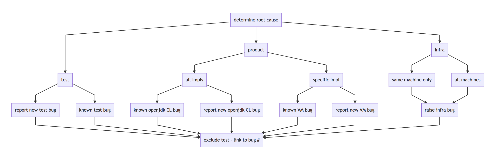

# Test Triage at AdoptOpenJDK

## Triage Guidance

There are [many different test jobs](https://ci.adoptopenjdk.net/view/Test_all/) running at the AdoptOpenJDK project.  No matter which test jobs are being triaged, there is a straight-forward pattern to follow: 
#### Categorize the test failure (based on test output) into 1 of 3 general types: 
- infra problem (machine/network)
- test problem
- product problem 
#### Check for an existing issue 
- if issue already exists for the failure, annotate with additional information if needed
#### Raise an issue if no issue exists
- infra issue - raise an issue in [openjdk-infrastructure](https://github.com/AdoptOpenJDK/openjdk-infrastructure/issues)
- test issue - ideally, there are enough details to determine which test repo to raise an issue in ond of the test repos from which test material is pulled (OpenJDK, [openjdk-systemtest](https://github.com/AdoptOpenJDK/openjdk-systemtest/issues), [openjdk-tests](https://github.com/AdoptOpenJDK/openjdk-tests/issues) or any of the various 3rd party application suites).  If in doubt, ask some questions in the [#testing channel](https://adoptopenjdk.slack.com/messages/C5219G28G) and/or raise in [openjdk-tests](https://github.com/AdoptOpenJDK/openjdk-tests/issues) where it will get routed to proper repo
  - OpenJDK test issues - see [Guidance for creating OpenJDK bugs](https://github.com/AdoptOpenJDK/openjdk-tests/wiki/Guidance-for-Creating-OpenJDK-Test-Defects) 
  - Additional guidance for external tests - [Triage Rules for Application tests](https://github.com/AdoptOpenJDK/openjdk-tests/tree/master/thirdparty_containers#triage-rules)
- product issue - additional steps may be necessary, before raising an issue
  - rerun the test - locally or using a Grinder: see [How to Run a Grinder wiki](https://github.com/AdoptOpenJDK/openjdk-tests/wiki/How-to-Run-a-Grinder-Build-on-Jenkins)
  - determine if the problem is occurs in other jdk versions, implementations and on other platforms
  - if only observed against 1 implementation, raise an issue against that implementation in the correct upstream repo (typically either OpenJDK or [Eclipse OpenJ9](https://github.com/eclipse/openj9/issues) projects).  
#### Exclude the test
- exclude in the most minimal way possible, if failing only on 1 platform, version or implementation, only exclude for that instance
- put the full link to the associated open issue into the exclude file
- exclude files vary depending on what test group you are triaging, refer to the README files in the openjdk-tests subdirectories for more details
  - for openjdk tests, see [Exclude an openjdk test](https://github.com/AdoptOpenJDK/openjdk-tests/tree/master/openjdk_regression#exclude-a-testcase)
  - for other tests (like system, external and perf tests), tests are typically disabled via the associated playlist.xml (see [example playlist](https://github.com/AdoptOpenJDK/openjdk-tests/blob/master/thirdparty_containers/example-test/playlist.xml)) file either by using `<platformRequirements>^os.win</platformRequirements>` if by platform, or `<disabled>` tag if for all platforms/versions/implementations

---------------------------

## AdoptOpenJDK Test Triage Rotas

### OpenJ9 Rotas:
- [OpenJDK8](./openj9_test_triage_rotas.md#8)
- [OpenJDK11](./openj9_test_triage_rotas.md#11)
- [OpenJDK12](./openj9_test_triage_rotas.md#12)
- [OpenJDK Head](./openj9_test_triage_rotas.md#head)

### Hotspot Rotas:
- [OpenJDK8](./hotspot_test_triage_rotas.md#8)
- [OpenJDK11](./hotspot_test_triage_rotas.md#11)
- [OpenJDK12](./hotspot_test_triage_rotas.md#12)
- [OpenJDK13](./hotspot_test_triage_rotas.md#head)

### Details:

Triage is defined here as "Exclude the failing test, raise a bug against the relevant party, and put the bug URL in the exclude file.".

Triagers named in the rotas linked above are committed to "best effort" triage on test runs which are:
- That test group.
- That platform.
- That release.
- That Virtual Machine.
- Run against release streams.
- Run as part of a predetermined test schedule (e.g. the automated nightlies).

Triagers named above are *not* committed to triaging test runs which are:
- Run by an individual.
- Run against private forks/branches.
- Run outside of the predetermined schedule.
- Run using any test material other than the primary source for that platform/release/test group.
- Run without the triager's knowledge.

(Note: These are guidelines only, and do not restrict triagers from committing to perform triage outside of these limits.)

Finally, do note that the triagers in the rotas do not have a monopoly on triaging. 

Non-rota individuals are explicitly welcome to perform triage as and when they can.
